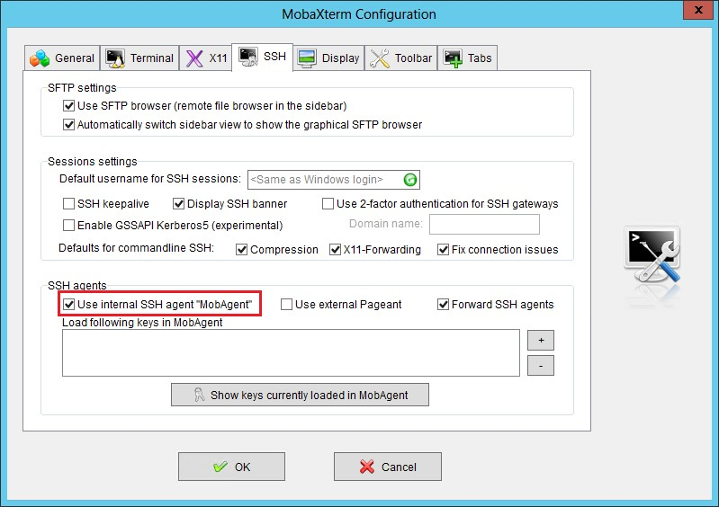
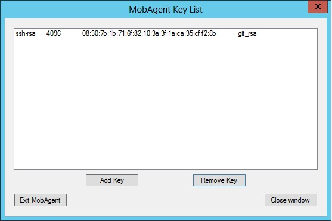

# Configuring MobaXterm

To configure the MobaXterm SSH client to use agent keys, do the following:

- Edit the configuration in MobaXterm by selecting “Settings -> Configuration”
- Select the SSH tab in the Configuration UI
- Under the “SSH agents”, select the ‘Use interal SSH agent “MobAgent”’



- Click on the ‘Show keys currently loaded in MobAgent’
  - If this is the first time clicking on this, it will state that the MobAgentis not running and would you like to start it. Select yes.
- Close the MobAgent Key List UI
- Close the Configuration UI
- You are required to restart MobaXterm at this point.
- After MobaXterm restarts. Log back onto your Linux system and run the following command:<br>
   ```ssh-add /<user>/.ssh/id_rsa```
- In MobaXterm, open the “Settings -> Configuration” UI again then click on
the “Show keys currently loaded in MobAgent”


